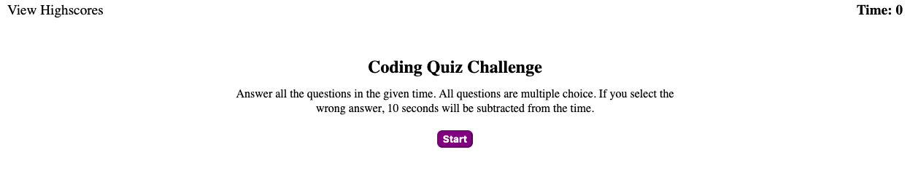

# Coding Quiz

## Links
[Click to view live site](https://zachshouts.github.io/coding-quiz/)

## Description

During this challenge we used JavaScript to dynamically update our page using the following:

* Used queries to select specific DOM elements

* Removed and/or altered said DOM elements through JS

* Created new elements through JS and appended them to the DOM

* Utilized event listeners to make the page responsive to user input

* Utilized local storage to store and display current and previous attempts

* Successfully implemented intervals and timeout functions